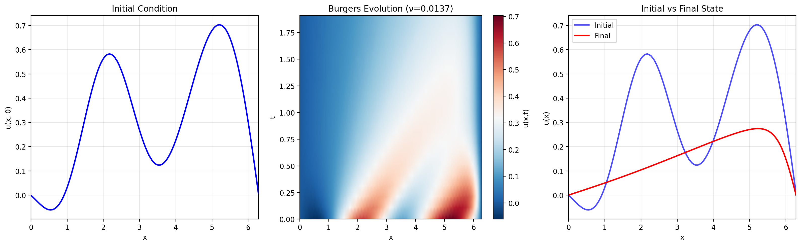

# 1D Burgers Equation Dataset (FEniCS Implementation)

This dataset generates samples from the 1D viscous Burgers equation using FEniCS/DOLFINx for robust finite element simulation of nonlinear PDE dynamics.



## Mathematical Formulation

**Equation:** 1D viscous Burgers equation
```
∂u/∂t + u∂u/∂x = ν∂²u/∂x²,   x ∈ [0, 1], t ∈ [0, T]
```

**Boundary Conditions:** Homogeneous Dirichlet
```
u(0, t) = u(1, t) = 0
```

**Initial Conditions:** Smooth random functions from Gaussian process
```
u(x, 0) = u₀(x) ~ GP(0, k(x,x'))
```

## Physical Significance

The Burgers equation models:
- **Nonlinear advection** (u∂u/∂x): Wave steepening leading to shock formation
- **Viscous diffusion** (ν∂²u/∂x²): Smoothing and energy dissipation  
- **Competition** between nonlinearity and diffusion at different viscosity scales

This makes it ideal for studying operator learning on nonlinear PDEs with shock dynamics.

## Dataset Features

- **Random initial conditions**: GP sampling ensures smooth, diverse profiles
- **Random viscosity**: ν ∈ [0.01, 0.1] for multi-scale dynamics
- **Full trajectories**: Complete space-time evolution for operator learning
- **Robust numerics**: FEniCS + Newton method handles nonlinear terms accurately

## Variables

The dataset returns a dictionary with the following fields:

### Coordinates
- `spatial_coordinates`: `(Nx,)` - Physical x coordinates on scaled domain
- `time_coordinates`: `(nt,)` - Time evolution points

### Solution Fields
- `u_initial`: `(Nx,)` - Initial condition u₀(x)
- `u_trajectory`: `(nt, Nx)` - Complete space-time solution u(x,t)

### Parameters
- `viscosity`: Viscosity coefficient ν (randomly sampled per sample)
- `domain_length`: Physical domain length (for coordinate scaling)
- `timestep`: Time integration step size used
- `save_interval`: Trajectory sampling interval

## Dataset Parameters

- **Computational domain**: [0, 1] (unit interval)
- **Physical domain**: Scaled to specified length (default: 2π)
- **Default grid points**: 128 spatial points
- **Default time range**: [0, 2.0] 
- **Spatial resolution**: P1 Lagrange finite elements
- **Temporal resolution**: 0.01 time units with backward Euler

### PDE-Specific Parameters
- **Viscosity range**: ν ∈ [0.01, 0.1] (randomly sampled)
- **Boundary conditions**: Homogeneous Dirichlet (u = 0 at boundaries)
- **Initial conditions**: GP-sampled smooth functions with zero BCs
- **Time integration**: Implicit backward Euler with Newton solver

## Installation

```bash
pip install -r requirements.txt
```

**Note**: Requires FEniCS/DOLFINx installation. Run in appropriate container or environment.

## Usage

### Basic Usage
```python
from dataset import BurgersDataset

# Create dataset
dataset = BurgersDataset(
    Lx=2*np.pi,           # Physical domain scaling
    Nx=128,               # Spatial resolution
    stop_sim_time=2.0,    # Simulation time
    timestep=0.01,        # Time step
    save_interval=10      # Trajectory sampling
)

# Generate sample
sample = next(iter(dataset))
print(f"Initial condition shape: {sample['u_initial'].shape}")
print(f"Trajectory shape: {sample['u_trajectory'].shape}")
print(f"Viscosity: {sample['viscosity']:.4f}")
```

### Generate Dataset
```bash
python generate_data.py  # Creates train/test splits as parquet files
```

## Visualization

Run the plotting scripts to visualize samples:

```bash
python plot_sample.py      # 3-panel plot: initial, evolution, comparison
python plot_animation.py   # Animated shock formation and evolution
```

## Implementation Details

- **Solver**: DOLFINx finite elements with Newton's method
- **Time integration**: Implicit backward Euler for stability  
- **Spatial discretization**: P1 Lagrange elements on unit interval
- **Nonlinear solver**: Newton iteration with automatic Jacobian
- **Boundary conditions**: Essential BCs enforced strongly

## Files

- `dataset.py`: Main BurgersDataset class with FEniCS solver
- `generate_data.py`: Batch generation and parquet export
- `plot_sample.py`: 3-panel visualization (initial, evolution, comparison)  
- `plot_animation.py`: Time evolution animation with shock tracking
- `requirements.txt`: Dependencies including FEniCS/DOLFINx

## Data Generation

Generate the full dataset:

```bash
python generate_data.py
```

This creates train/test splits saved as chunked parquet files in the `data/` directory.